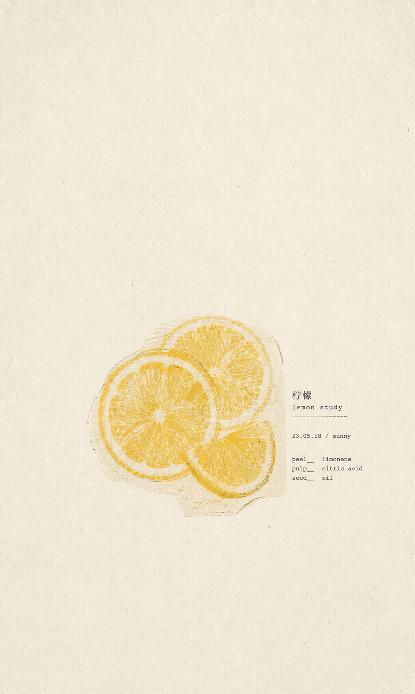
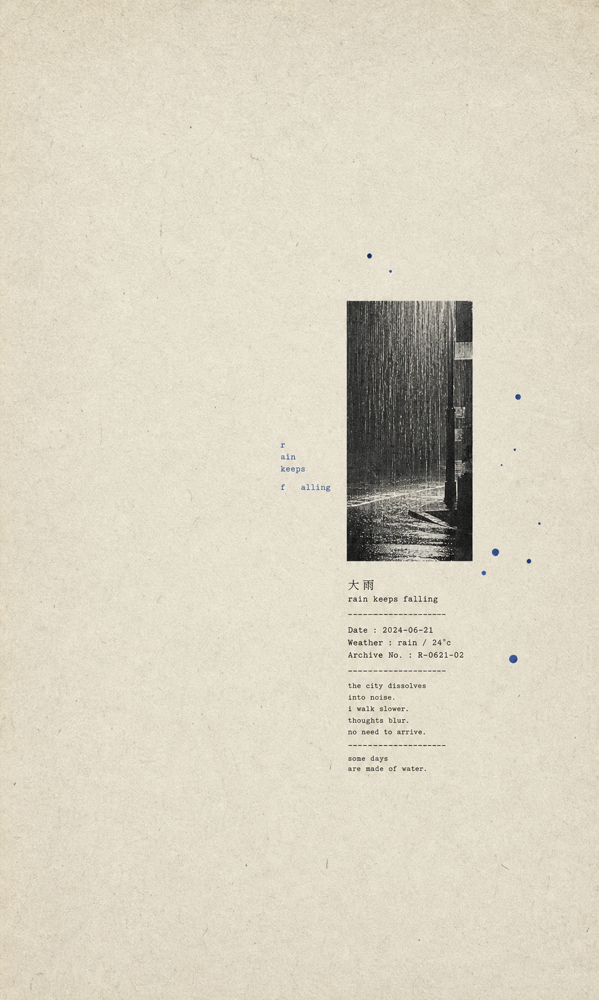

# 情绪海报生成器 (Emotion Poster Generator)

把用户的 prompt 转换成生成的位图图像，以及可追溯的最终 prompt。

## 示例

| 柠檬 | 下雨天 |
| --- | --- |
|  |  |

## 运行环境要求

⚠️ 本 skill 的"生成图像"这一步，依赖所在 AI agent 环境自带的文生图（text-to-image）能力。

- 目前已验证可以在具备图像生成能力的 **Codex** 环境中完整运行——走完 Mode/Category/Prompt Compiler 流程后，agent 会直接调用图像生成能力产出真实图片文件。
- **Claude Code CLI 本身不自带图像生成能力**。在纯 Claude Code CLI 环境下，本 skill 只能走完 Mode / Category / Prompt Compiler 的推理流程，产出最终的图像生成 prompt 文本，但无法直接生成图片文件。
- 如果所在环境没有可用的文生图工具：请照常完成 Workflow 中 1-3 步（解析、选配方、编译 prompt），在第 4 步"生成图像"处明确告知用户当前环境不具备生图能力，并把编译好的最终 prompt 原样交给用户，由用户拿去有文生图能力的工具（例如接了图像生成能力的 Codex、Midjourney、DALL·E 等）执行生成。不要假装已经生成了图片。

## 何时使用这个 Skill (When to Use This Skill / 触发条件)

在用户提出以下需求时触发本 skill：

- 想要一张安静、极简的"情绪海报"（emotion poster），素材来自一个主题、情绪、照片、日记片段或短文案
- 想要从一份清单、表格，或一批主题的 CSV，批量生成一系列这样的海报
- 想把一张照片转换成留白很大、有纸张纹理和微型排版的 zine 风海报

不要用它来做写实修图、完整场景插画、商业广告/海报版式，或字面意义上的人物肖像摄影——这些都超出本 skill 的视觉语法范围。

本 skill 同时支持单图和批量生产。根据用户的 prompt 自行判断模式、内容类别和视觉子风格，而不是让用户去挑选另一个 skill。

目标图像语言是"安静极简的 zine 风情绪海报"：大面积具有材质感的纸面、一个像偶然留下的微小视觉事件、具有空间节奏的碎片排版，以及面积很小但能被记住的强调色。纸张颜色和表面可以变化，但必须保持克制；不要把"复古"误解成统一泛黄、重度磨损或模板化做旧。保留稀疏情绪海报作品的精神内核，但不要照搬任何创作者的具体版式、标题格式、签名、水印、重复出现的专有标记，或已有图像。

## 风格核心（Aesthetic Core）

这套视觉语言的核心不是"白底 + 小图 + 标签"，而是控制注意力与含义的露出程度。

- **让空白承担情绪**：空白不是等待填充的背景，而是距离、停顿、温度和孤独本身。标准稀疏构图保留 78%-90%，极端留白构图保留 86%-94%，文字场或编辑页构图保留 65%-82%；不要机械套用一个比例。
- **让锚点像痕迹，不像图标**：优先使用过曝照片碎片、扫描切片、模糊植物、半透明切面、阴影、光斑或难以辨认的影像；避免过于完整、光滑、可解释的符号。
- **只保留一个隐喻**：不要同时解释主题、展示数据、添加装饰并重复文案。观者应该先感到某种情绪，再慢慢读懂主题。
- **让文字参与空间，而不是说明图片**：文字可以横向漂移、断裂、稀疏重复、被图像截断，或变成低对比的幽灵正文。它与锚点形成距离和方向，不只是整齐贴在下方的标签。
- **保留轻微的不确定性**：允许视觉簇偏心、图文错位、局部曝光失真和不完全对齐。不要把画面修成规整的信息图或品牌模板。
- **控制语义层级，而不是减少文字**：图内可以有丰富英文文案，但只允许一条主句处于前景；辅助句和正文通过更小字号、更浅灰度退到中景与背景。较完整的解释仍可放在交付说明中。
- **优雅先于实验**：默认先保证轻、淡、细和稳定，再加入一次局部错位。不要通过粗黑大字、强对角线、巨大污渍、撕裂或重颗粒证明“实验感”。

## 参考资料路由（Reference Routing）

- 当任务以文字排版为核心、用户要求逼近案例的精神，或主句与图像关系不明确时，先读 `references/style-study.md`。
- `references/cases/` 中的图片只用于内部视觉校验：检查抽象出的规则是否成立，不作为图生图输入，也不要在生成 prompt 中写创作者姓名、账号名或作品标题。
- 优先复用研究中提炼的角色、行为和构图原型；不要复刻某张案例的句子、位置、色彩与图像组合。
- 如果最终 prompt 明显对应单一案例，至少改变锚点、文字行为、运动方向、位置和色彩中的三项。

## 文字引擎（Typography Engine）

文字不是附在图片下面的说明，而是控制视线移动的第二个图像系统。每张海报先分配文字角色，再决定字体、字号与位置。

### 文字角色

1. `primary-hook`：唯一需要清楚读懂的主句。中文通常 2-10 字，英文通常 2-10 词；不一定最大，但必须最先被发现。
2. `directional-thread`：破碎词语、少量字母、重复字符或被截断的短语，用来连接图像和制造方向，不承担完整语义。
3. `atmospheric-field`：极淡正文、旧书页、打字稿或模糊说明形成灰度空气，可以不可读，但不能像随机水印。

Fruit 和 Still Object 默认同时使用三个角色，让文字形成完整的点、线、面构成。Mood 和 Photo Window 默认使用两个角色；极端留白题材才允许只使用一个。清晰度依次约为 `85%-100% / 35%-60% / 6%-18%`。

### 文案语言与生成

- 默认图内文案使用英文。用户明确提供要出现在画面中的中文或其他语言时，保持用户原文，不擅自翻译。
- 用户只给主题时，先生成一套语义统一的英文文案，而不是只写一个标签：
  - `primary line`：4-9 个词，一句可完整读懂的主句。
  - `supporting line`：6-14 个词，一行补充语义或改变观看方向。
  - `body block`：22-45 个词，组成 3-7 行低对比正文。
  - `point words`：2-4 个关键词，每个 1-3 个词。
- 四层文案必须共享同一语义核心。正文不能使用 lorem ipsum、随机乱码、无关诗句或伪档案信息。
- 图像模型文字能力有限时，`primary line` 必须准确，`supporting line` 尽量准确；`body block` 可以部分不可读，但必须保持真实英文单词结构和稳定的灰度形状。

### 点、线、面文字构成（Point-Line-Plane）

文字既承载语义，也承担几何构成。默认至少建立以下三种形态：

1. **点（Point）**
   - 1-3 个孤立关键词、短标签或极小标记。
   - 每个点只占很小面积，用来建立停顿、重心或色彩回声。
   - 不要把点平均撒满画布；它们应靠近图像边缘、正文块角落或视觉轴端点。

2. **线（Line）**
   - 一条 4-14 词的单行主句或辅助句，也可以被图像打断成两个自然片段。
   - 线负责连接两个图像边缘、穿过主体或延长视线；长度通常横跨画布宽度的 18%-45%。
   - 文字线可以轻微错位，但不能变成角到角的粗重字带。

3. **面（Plane）**
   - 由 3-7 行正文形成一个矩形或近似矩形的灰度块，宽度通常占画布 12%-28%。
   - 正文块首先被读作“灰色面积”，其次才被逐字阅读；行长和行距必须稳定。
   - 面可以部分藏在图像后方或横穿主体，但不能覆盖主句层级。

点、线、面不得全部使用同一字号、字重、灰度或对齐方式。至少建立三档色调：前景主句 `85%-100%`、中景线/关键词 `35%-60%`、背景正文 `6%-18%`。画面应有一处紧密文字密度、一处松散间隔和一处安静空白，形成节奏，而不是均匀分布。

### 字体、比例与节奏

- 最多使用两个字体家族：一套有编辑气质的衬线体负责主句，一套克制的等宽/打字机体负责正文、关键词和辅助线。
- 使用三个清楚区分的字号层级，建议相对比例约为 `1 / 0.75 / 0.55`；不要堆叠许多彼此只差一点的字号。
- 句子使用正常或略紧字距；只有极小的大写关键词允许轻微加宽。不要把宽字距施加到正文或完整句子上。
- 正文块行距保持紧凑稳定，形成完整灰面；主句周围留出更大间距，使其从文字面中浮出来。
- 对齐依赖图像边缘、文字块边缘和隐形基线，而不是全部依赖画布中心。允许一个元素轻微破格，但其余元素要提供稳定秩序。

### 文字行为与使用频率

八种行为不是等权选项。默认从高频层选择；只有用户明确要求文字主导、宣言感或强实验排版时，才能进入例外层。

**高频默认**

- `micro-anchor-caption`：微型主句停在照片边缘、物件旁或视觉簇内部，并保持不对称距离。
- `horizontal-thread`：文字从图像一侧进入，穿过或绕过照片，再从另一侧离开；部分字符可以被遮挡。
- `ghost-body-layer`：低对比正文形成一块灰色空气，退在主句和图像之后。

**少量使用**

- `letter-field`：少量字母、蓝点或短字符形成有密度变化和方向的稀疏场。
- `image-interruption`：可读文字被照片、色块、笔刷或裁切打断，且遮挡本身承担含义。
- `edge-orbit`：文字沿照片边缘、圆形物件、人物轮廓或虚构轨道分布，轨迹通常不闭合。

**罕见例外**

- `vertical-spine`：长文字旋转或沿画布高度生长，成为单一纵向轴线。仅限明确的文字主导任务。
- `scale-collision`：较大短句与极小正文或照片碎片产生尺度冲突。仅限用户明确要求实验大字；不能作为普通主题的自动选择。

### 文字选择规则

- 一张图只允许一个 `primary-hook`，并按自然中文词组形成 1-3 个簇；不要把中文逐字等距排开。
- 默认主句使用小号、细字重、低对比但可读的排版；不要为了制造实验感自动放大。
- 默认禁止粗黑大字、巨大英文单词、文字大面积出界和角到角的强对角字带。
- 大面积轮廓字只有在笔画极细、对比极低、仍然像空气而不是标题时才允许。
- 一张图只保留一条主要运动轴：横向、纵向、对角或环绕四选一。
- 随机字母必须来自主题词、主句拼音、日期语境或相关英文词根，不能生成无语义来源的乱码。
- 如果图像占画布 20% 以上，主句回到微型尺度；如果主句很大，图像必须更小。
- 档案编号、天气、温度和测量值只有在主题确实需要理性档案感时才出现，不能用来填空。

## 模式路由（Mode Routing）

根据用户的 prompt 选择一种模式。

- Single Mode（单图模式）：一个主题、句子、物件、照片，或一种情绪。
- Text Mode（文字驱动模式）：主要输入是一句话、一段文字、一首诗、一句引言、一个标题，或一段日记。
- Photo Mode（照片驱动模式）：用户提供一张或多张图片，要求转换成本海报体系。
- Batch Mode（批量模式）：用户要求"batch"、"一组"、"多张"、"批量"、"系列"，或给出了一份清单、表格、CSV、文件夹，或多个独立条目。
- Series Mode（系列模式）：用户想要一组视觉上连贯、配方相关的海报。

优先级规则：

- 一份清单或表格里有 2 个或以上独立条目，判定为 Batch Mode。
- 提供一张照片加一句简报，判定为 Photo Mode。
- 提供多张照片，或一个照片文件夹加多份简报，判定为 Batch Mode 或 Series Mode。
- 一段较长的文字，除非其中包含多个独立的海报条目，否则应判定为 Text Mode。
- 如果 prompt 含糊不清，且不同判断会显著改变成本或产出数量，向用户提出一个简短的澄清问题。

## 类别路由（Category Routing）

选定模式后，把每个输出归入一个视觉类别。

- Fruit（水果）：苹果、梨、橙子、番茄、番石榴、柠檬、西瓜、草莓、樱桃、水果汽水、以水果形式出现的食物。
- Mood（情绪）：空、压力、治愈、等待、慢下来、孤独、脆弱、平静、记忆、呼吸、发呆、自由、光、雨、夜晚。
- People（人物）：自我、孩子、女性、老年、凝视、关系、对话、关怀、自由、脆弱、身体、姿态、肖像类 prompt。
- Still Object（静物）：风筝、时钟、陶瓷、灯笼、贝壳、咖啡、树枝、花、树、纸、椅子、锥形物、扇子、窗、书、日常物件。

类别判定规则：

- 如果 prompt 点名了一种具体水果，即便文案很情绪化，也归为 Fruit。
- 如果 prompt 点名了一个人或肖像，归为 People，但除非用户明确要求正面写实肖像，否则避免字面意义上的正脸构图。
- 如果 prompt 点名了一个非水果的实体物件，归为 Still Object。
- 如果 prompt 是抽象的或以情绪为主，归为 Mood。
- 批量生产时，为每一行记录类别，让视觉语法有意地产生变化。

## 分类视觉语法（Category Grammars）

在选定最终配方之前，先套用以下按类别划分的视觉语法。

### Fruit（水果）

- 把水果当作标本、切面、半透明切片、撕纸印刷,或一次小型色彩研究来处理。
- 水果簇放在画面中心或略低于中心；保持足够小，让纸张本身先被读到。
- 使用一种高辨识度的水果色：番茄红、苹果红、浅黄、番石榴粉、柑橘黄、暖橙,或柔和绿。
- 默认加入完整英文文案包：孤立关键词作为点，主句/辅助句作为线，低对比正文块作为面。日期、天气和成分说明只有主题明确需要时才出现。
- 避免可爱的水果贴纸、生鲜广告、多汁的商业食物摄影、盘子、桌子、手,以及完整的静物场景。

### Mood（情绪）

- 把情绪转化成一个含义不完全闭合的视觉痕迹：过曝光斑、散落字母、一条细线、一小片阴影、雾蒙蒙的纸窗、极小的远景、模糊植物,或一张被截断的照片。
- 主体可以几乎"什么都没有"；情绪张力应该来自距离、位置偏移、留白、纸张温度和文字的空间轨迹。
- 电光蓝、钴蓝、浅青、灰黑,或一个极小的红色标记都很合适。
- 使用一句极短的诗意文字、断裂词语、横向漂移的字母、低对比的"幽灵文字",或近乎无法完整阅读的正文痕迹。
- 避免把抽象情绪翻译成完整仪表盘、温度计、轨道图、说明性图解或过度精确的数据可视化。
- 避免字面意义的表情符号、治愈系海报式语言、鸡汤金句版式、大幅书法,或装饰性的色块团。

### People（人物）

- 不要默认画成写实肖像。把"人"转译成剪影、被裁切的姿态、阴影、极小的背影、纸质剪影、照片碎片、一条视线,或某个代指人的物件。
- 除非用户明确要求一个可辨认的人物，否则脸部应保持极小、局部、被遮挡,或干脆不出现。
- 使用纪实风格的微型文字、日期/地点注解、一句安静的文案,以及附着在"人物符号"上的一小块强调色。
- 好用的锚点：一个小外套剪影、一个手部裁切、作为纸张纹理的一双眼睛、一个极小的行走人影、一张撕破的证件照碎片、一把椅子、一扇窗,或一片阴影。
- 避免时装编辑大片、写实证件照式头像、美妆写真、电影感人物场景、社交媒体金句卡片,以及煽情插画。

### Still Object（静物）

- 把物件当作一份扫描标本、照片碎片或纸上留下的痕迹来处理，而不是完整的产品图标。
- 只用一个物件，或一个物件加一小块纸张/照片碎片。
- 优先选择细线条的树枝图解、旧扇子、时钟、陶瓷、贝壳、风筝、花、纸片、杯子、书、灯笼、窗,或日常工具。
- 默认配上完整英文文案包，把孤立关键词、单行主句/辅助句和幽灵正文分别组织为点、线、面；测量数据只有在主题本身需要理性档案感时才使用。
- 避免产品广告感、写实桌面摄影、温馨生活方式场景、密集拼贴、完整信息图、大面积阴影,以及明显的样机效果。

## 视觉子风格路由（Visual Substyle Routing）

完成类别路由后，选择一种视觉子风格。子风格控制画面语法；内容类别控制主体会变成什么。

- `blue-signal`：饱和的蓝色圆点、蓝色文字、蓝色笔刷/剪切标记,或蓝色碎片承载情绪。
- `photo-window`：一张小照片、两张叠放的照片面板，或一条窄窄的竖向小图条浮在纸面上。
- `fruit-specimen`：水果被处理成切面、半透明切片、老式印刷标本,或一次小型色彩研究。
- `person-obscured`：人物以极小的背影、被裁切的姿态、阴影、证件照碎片,或被遮挡的脸出现。
- `text-field`：排版本身是主要的视觉事件；图像可以缺席或退居次要。
- `object-archive`：一件非水果物件变成带标签、测量文字或图解标记的扫描标本。
- `editorial-page`：更接近杂志式的构图，有更大的文字、长段的幽灵文字、装订本/书页的质感，或分层的文字块。

子风格选择规则：

- Fruit 通常从 `fruit-specimen` 起手；只有当水果与天空、田野、季节,或记忆搭配时，才用 `photo-window`。
- Mood 可以用 `blue-signal`、`text-field`、`photo-window`,或 `editorial-page`。
- People 通常用 `person-obscured`；记忆/背影类场景用 `photo-window`，身份/自我定义类 prompt 用 `text-field`。
- Still Object 通常用 `object-archive`；贝壳、圆点、星星,或抽象物件场时用 `blue-signal`；海、天空、雪,和风景碎片用 `photo-window`。
- 批量生产时轮换子风格，不要让每张图都变成同一种小照片窗口，或同一种蓝点场。

## 第一性原理 Prompt 字段（First-Principles Prompt Fields）

每条最终 prompt 都必须按顺序回答以下渲染问题。把答案当作具体的视觉约束来写，而不是分析性的散文。

1. 画布（Canvas）：竖版 3:5 纸质海报，满幅纸张，不要边框或样机效果。
2. 纸张基底（Paper Substrate）：从基底引擎选择一个预设，并分别写明色温、纹理类型和纹理强度；不要总用同一种灰白纸。
3. 注意力几何（Attention Geometry）：按构图选择空白比例——标准稀疏 78%-90%，极端留白 86%-94%，文字场/蓝色信号场/编辑页 65%-82%；视觉簇通常占 8%-26%，漂浮文字可以跨越更宽范围，但总体墨量仍然很低。
4. 内容类别（Content Category）：Fruit（水果）、Mood（情绪）、People（人物）,或 Still Object（静物）。
5. 视觉子风格（Visual Substyle）：`blue-signal`、`photo-window`、`fruit-specimen`、`person-obscured`、`text-field`、`object-archive`,或 `editorial-page` 之一。
6. 图像锚点（Image Anchor）：优先是一张过曝照片裁切、模糊影像、光斑、阴影、半透明切片、一道痕迹或被截断的物件；只有主题需要时才使用完整标本。
7. 锚点处理方式（Anchor Treatment）：默认从扫描、过曝、洗印、低对比影印、软边或局部遮挡中选择一种；网点、撕边、套印错位和明显失真只能少量使用，不能叠加成粗粝拼贴。
8. 文字角色（Typography Roles）：指定 `primary-hook`、`directional-thread`、`atmospheric-field` 中的两个或三个，并写明唯一可读主句。
9. 点线面文字构成（Text Geometry）：分别指定 point words、single line 和 body block 的内容、位置、宽度与灰度；说明哪一层与图像接触、穿过或分离。
10. 文字行为与运动轴（Typography Behavior and Axis）：默认从高频行为中选择，并指定局部、横向、纵向、对角或环绕方向；罕见行为必须有用户明确触发条件。
11. 排版系统（Typography System）：最多两种字体家族、三档字号或字重、三档灰度；日期/天气/索引只能作为次要痕迹。
12. 色彩逻辑（Color Logic）：一个在缩略图尺寸下依然清晰可见的色彩记忆点，其余保持克制。
13. 分辨率与清晰度（Resolution and Clarity）：高分辨率原图、锚点边缘清晰、主要短文字可读，纹理作为印刷质感呈现而非模糊。
14. 情绪温度（Emotional Temperature）：安静、疏离、私密、诗意、档案感、稀疏、克制。
15. 硬性避免项（Hard Avoids）：不要完整场景、广告、大幅商业标题、贴纸拼贴、完整仪表盘或说明性信息图、光滑图标、时装/美妆肖像、3D、霓虹、光面样机,或千篇一律的模板化精修感。

## 纸张基底引擎（Paper Substrate Engine）

纸张不是永远相同的中性背景，而是情绪、年代感和色彩关系的一部分。每次生成分别选择色温、表面纹理和强度，再组合成一个基底预设。

### 九种基底预设

- `sage-weave`：低饱和灰绿色，极细纵横织纹，理性、植物性、安静。
- `warm-fiber`：浅米杏色，可见但柔和的纸纤维，温暖、日记感、自然。
- `clean-cream`：奶油白或暖象牙白，近乎纯哑光，只保留微弱纸感。
- `ivory-mottle`：象牙灰白，轻微云斑和不均匀吸墨感，柔软、旧印刷感。
- `honey-pulp`：蜂蜜米黄色，细纸浆颗粒和轻微深浅变化，适合果实、夏日和温暖静物。
- `warm-gray-matte`：浅暖灰，均匀哑光，适合人物、黑白照片和安静正文。
- `cool-linen`：冷白或极浅蓝灰，细密水平亚麻纹，清醒、空气感、现代。
- `stone-speckle`：浅石灰色，稀疏微颗粒和轻扫描点，适合记忆、档案和沉静主题。
- `fog-taupe`：雾灰褐或灰米色，低对比平滑纸面，适合低饱和人物和阴天情绪。

### 纹理强度

- `clean`：纹理约 1%-3% 可见度，只消除数字白板感。
- `tactile`：纹理约 4%-8% 可见度，能在空白区被感知，但不影响文字。
- `material-led`：纹理约 9%-15% 可见度，纸张成为明显的视觉材料；只在极简构图或用户明确要求底纹时使用。

### 类别路由

- Fruit：优先 `clean-cream`、`warm-fiber`、`honey-pulp`；酸味、清爽水果可改用 `cool-linen`。
- Mood：优先 `cool-linen`、`stone-speckle`、`fog-taupe`；温暖记忆可用 `ivory-mottle`。
- People：优先 `warm-gray-matte`、`ivory-mottle`、`fog-taupe`。
- Still Object：优先 `sage-weave`、`warm-fiber`、`stone-speckle`；明亮物件可用 `clean-cream`。

### 选择规则

- 默认使用 `clean` 或 `tactile`；`material-led` 不能与重颗粒图像、密集正文和多重做旧同时出现。
- 基底色必须与主体形成轻微冷暖或明度差，不能把主体吞没，也不能为了对比退回纯白或纯黑。
- 不要把所有复古纸都理解成泛黄。灰绿、冷白、石灰、灰褐和奶油白同样属于可用的旧纸系统。
- 连续两张独立海报默认避免使用完全相同的基底预设与强度，除非用户要求系列一致。

## 色彩引擎（Color Engine）

每张图使用一种主要色彩记忆点。它需要可辨认，但不必高饱和。

- 默认优先浅青、灰蓝、淡紫、柠檬黄、柔和绿、暖橙或照片自身残留色；电光蓝、钴蓝和高饱和红只在 `blue-signal` 或主题确实需要强信号时使用。
- 保持纸张、灰阶照片、微型文字和次要标记的克制感；强调色可以是一枚纯色痕迹，也可以只是照片里残留的一小块颜色。
- 色彩锚点大约占整个画布的 0.8%-3%，或占视觉簇的 15%-40%。
- 色彩可以是主体本身、一个笔刷/剪切标记、一个印刷色块、蓝色圆点、破碎字体、照片色调,或一个小的平面剪影。
- 可以使用 `pale`、`faded`、`soft` 或 `low-contrast` 描述轻盈色彩，但必须保留一个在缩略图中仍可察觉的色彩关系。
- 黑白档案/照片逻辑可以只用 `charcoal-black`（炭黑）加一丁点偏蓝紫的文字；不要为了满足配色规则强行加入第二种大面积颜色。
- 批量生产时，至少一半的输出应该有清晰可见的彩色锚点，不要全是灰色照片和极小的黑色文字。

## 分辨率与清晰度（Resolution and Clarity）

低保真的印刷风格，不等于低分辨率的输出。

- 在 prompt 中要求高分辨率的竖版海报原图，适合在手机上清晰查看，也便于之后做 2 倍放大导出。
- 让纸张纹理、扫描噪点、网点、影印磨损和墨渍保持轻微，不要模糊到主锚点。
- 主要的短文字、日期标签、标本标签和主要的微型排版，字形应该清晰锐利。次要的幽灵文字可以半透明、半可读。
- 水果果肉纹理、照片窗口边缘、剪影、蓝色圆点、色块、树枝图解和物件轮廓，都应保持干净、边界清晰。
- 除非用户明确要求，否则避免使用 `blurry`（模糊）、`out of focus`（失焦）、`soft overall image`（整体柔焦）、`low resolution`（低分辨率）、`pixelated`（像素化）,或 `heavy degradation`（严重劣化）这类措辞。
- 如果内置生成器返回的图像尺寸较小，向用户报告实际的像素尺寸。用于正式项目时，应重新生成或请求更高分辨率的版本，而不是把小尺寸预览图当作最终成品。

## 输入契约（Input Contract）

对于批量任务，接受 CSV 行、Markdown 表格、编号列表、纯主题清单，或一个参考图片文件夹加一段简短简报。

将批量输入内部归一化为：

```csv
id,theme,copy,mood,accent,reference_image,notes
001,橘子汽水,夏天慢慢醒来,summer,warm-orange,,
```

必填字段：

- `id`：稳定的输出编号。如果缺失就自己创建一个。
- `theme`：中心主题或想法。

可选字段：

- `copy`：要出现在图中的确切短句。
- `mood`：情绪方向。
- `accent`：用户指定的强调色。
- `reference_image`：本地路径，或已附带图片的角色说明。
- `notes`：约束条件、目标平台、画幅比例，或系列方向。

当用户提供的文字是要出现在图像中的内容时，保持原文精确不变。对于较长的文案，为图像本身提炼出一句短语，其余部分作为解读上下文保留。

## Prompt 编译器（Prompt Compiler）

把每条最终图像 prompt 写成四段紧凑的段落，只描述画面里可见的像素。

第一段：画布与构图

- 竖版纸质海报，默认 3:5。只有当用户或目标平台要求时才用 4:5。
- 从纸张基底引擎指定一个预设，并明确色温、表面纹理和 `clean / tactile / material-led` 强度；不要用笼统的“白纸”代替选择。
- 按版式选择留白：标准稀疏 78%-90%，极端留白 86%-94%，文字场、蓝色信号场或编辑页 65%-82%。
- 一个视觉簇通常占画布的 8%-26%；文字事件可以更宽，但墨量必须低。
- 视觉簇位置：居中、略高于中心、略低于中心、左下、右上，或一个安静的偏心位置。
- 不要边框、写实相框、app UI，或产品样机效果。

第二段：主体与图像锚点

- 根据类别语法和视觉子风格，把主题压缩成一个不完全解释自己的可成像隐喻。
- 锚点在缩略图尺寸下必须清晰可辨，但在整张海报上依然物理意义上很小。
- 好用的锚点：水果切面、植物枝条、星场、蓝点星座、蓝色笔刷遮罩、小张照片裁切、撕纸色块、细线图解、日常物件、极小剪影、被遮挡的脸、阴影、窗、风景碎片、幽灵文字块，或抽象的情绪符号。
- 如果提供了照片，把它当作版面内的一张小纸质剪贴、一张联系样片、一块洗印过的照片面板，或一个裁切碎片来处理。
- 用一个含义明确但视觉上略带含混的隐喻，而不是一整个完整插画场景、完整符号或解释性图表。

第三段：文字角色、行为、强调色与印刷质感

- 默认编写一套英文文案：准确的 `primary line`、一条 `supporting line`、一个 22-45 词的 `body block` 和 2-4 个 `point words`；用户提供确切文字时保持原文。
- 明确 point、line、plane 三种文字形态的具体内容、位置、宽度、对齐关系和灰度，让主句是前景、辅助线是中景、正文块是背景。
- 默认从 `micro-anchor-caption`、`horizontal-thread`、`ghost-body-layer` 中选择一种主行为，并写明文字与图像边缘的关系。只有用户明确要求文字主导时，才使用 `vertical-spine` 或 `scale-collision`。
- 方向线中的碎片必须来自主句、主题词、拼音或相关英文词根；氛围正文只形成低对比灰度面积。不要用无来源乱码。
- 使用极小的衬线体、等宽字体、打字机体，或精致编辑体，默认细字重、轻对比。不要自动生成粗黑大字或巨大英文；罕见大字必须保持细轮廓、低对比和安静气质。
- 除非主题明确需要，不要默认添加天气数值、测量刻度和档案编号。
- 使用色彩引擎里一种克制但清晰可见的强调色；它应该在缩略图尺寸下承载整张海报的记忆点。
- 加入极轻纸纤维、扫描灰尘、曝光泄漏、洗印感、孔版印刷颗粒、轻微墨渍或网点劣化；纹理必须接近察觉不到，不能抢走空白。
- 保持主锚点边缘和主要短文字清晰；纸张瑕疵应该停留在表层，不要糊到主体上。

第四段：情绪与负面约束

- 平铺直叙、正视角的扫描纸张氛围。
- 安静、私密、诗意、缓慢、通透、克制、略带怀旧、编辑感、低保真印刷。
- 避免满版场景、商业广告、大幅标题、logo、CTA、光面样机、生硬阴影、电影感打光、3D、霓虹、动漫风、可爱贴纸、密集拼贴、图库摄影式写实、鸡汤金句海报,以及千篇一律的通用 AI 海报精修感。

## 配方维度（Recipe Axes）

每张图从每个维度中选一个值。批量生产时，在保持系列方向一致的前提下，让各行之间的配方产生变化。

### 版式（Layout）

- `center-specimen`：一个极小的物件或照片碎片，居中放在大片空白纸面上
- `lower-left-diary`：小视觉簇偏左下，上方留白安静
- `upper-right-note`：右上方一小块纸/照片，配松散的微型文字
- `micro-contact-sheet`：3-6 个极小的画格，排成一张紧凑的联系样片
- `paper-fragment-stack`：两三张互相叠放的纸片
- `type-and-object`：一句短语加一个小物件组成视觉簇
- `blue-dot-field`：饱和蓝色圆点稀疏地散布在安静纸面上
- `blue-brush-mask`：一笔饱和的蓝色笔刷或纸条，遮住一张脸、一个字，或一小张图
- `star-orbit`：星星、圆点，或散落字母松散地环绕一个小锚点
- `fruit-cutaway-study`：水果切片或切面，作为一份极小的标本
- `thin-diagram`：环绕一个物件的细线注解
- `small-window-block`：一小块方形照片/色块，配微型标签
- `vertical-photo-strip`：两三张极小照片窗口竖向叠放
- `dual-photo-panel`：两张相邻或叠放的照片面板，中间留一道窄缝
- `quiet-silhouette`：一个极小的人物、阴影、姿态,或局部人影，置于空白纸面上
- `ghost-text-page`：一大片淡淡的文字区域或正文色块，成为背景纹理
- `type-as-object`：更大幅的实验性文字，作为主要锚点
- `horizontal-letter-drift`：一条很轻的断裂文字轨迹横向穿过小图像，文字密度低、间距不规则
- `off-center-image-thread`：一个偏心照片碎片与少量漂浮字母形成细长的视觉线索

### 锚点（Anchor）

- `fruit-specimen`
- `translucent-fruit-slice`
- `blue-dot-constellation`
- `blue-brush-obscuration`
- `scattered-star-sign`
- `thin-branch-diagram`
- `tiny-faded-photo`
- `washed-paper-block`
- `paper-clipping`
- `small-landscape-window`
- `daily-object-specimen`
- `quiet-person-silhouette`
- `partial-gesture-crop`
- `obscured-face-fragment`
- `shadow-or-trace`
- `ghost-body-text`
- `abstract-texture-window`
- `micro-contact-sheet`
- `overexposed-photo-fragment`
- `faded-light-spot`

### 排版（Typography）

- `tiny-caption`
- `edge-phrase`
- `archive-microtext`
- `broken-english-fragments`
- `date-weather-label`（仅在主题明确需要天气/日期语义时）
- `scattered-letters`
- `vertical-note`
- `gray-ghost-text`
- `large-quiet-type`
- `body-copy-texture`
- `almost-textless`
- `specimen-label`
- `small-title-plus-index`
- `letter-drift`
- `interrupted-phrase`
- `micro-anchor-caption`
- `horizontal-thread`
- `letter-field`
- `ghost-body-layer`
- `image-interruption`
- `vertical-spine`（罕见，仅在用户明确要求文字主导时）
- `edge-orbit`
- `scale-collision`（罕见，仅在用户明确要求实验大字时）

### 纹理（Texture）

- `aged-paper-fibers`
- `soft-scan-noise`
- `xerox-softness`
- `risograph-grain`
- `light-ink-bleed`
- `faint-pencil-annotation`
- `washed-photo-print`
- `subtle-halftone`
- `low-contrast-photocopy`
- `clean-paper-haze`
- `exposure-leak`

### 纸张基底（Paper Substrate）

- `sage-weave`
- `warm-fiber`
- `clean-cream`
- `ivory-mottle`
- `honey-pulp`
- `warm-gray-matte`
- `cool-linen`
- `stone-speckle`
- `fog-taupe`

### 基底强度（Substrate Intensity）

- `clean`
- `tactile`
- `material-led`

### 情绪（Mood）

- `summer`
- `quiet`
- `solitude`
- `inward`
- `afternoon`
- `night`
- `seaside`
- `childhood`
- `memory`
- `fruit-soda`
- `waiting`
- `small-joy`
- `rainy`
- `sleepy`
- `breathing`
- `vulnerable`
- `slow`
- `blank`

### 强调色（Accent）

- `electric-blue`
- `cobalt-blue`
- `sky-blue`
- `pale-cyan`
- `tomato-red`
- `apple-red`
- `guava-pink`
- `citrus-yellow`
- `pale-yellow`
- `soft-green`
- `warm-orange`
- `charcoal-black`
- `violet-blue`

## 工作流程（Workflow）

1. 解析用户的内容。
   - 识别模式、类别、视觉子风格、中心主题、情绪、用户提供的确切文字（如有）、视觉隐喻，以及是否使用了参考图片。
   - 默认生成英文文案包，并分配 `primary-hook`、`directional-thread`、`atmospheric-field`。Fruit 和 Still Object 默认同时使用三层；只有极端留白题材才减少层数。
   - 把文字映射成点、线、面：关键词是点，主句/辅助句是线，正文块是面，并为三者指定不同灰度与密度。
   - 对于复杂的想法，把它压缩成一个可成像的隐喻。
   - 先删去解释性的元素：如果照片碎片和一句短语已经能传达情绪，就不要再加入图标、刻度、数据和重复文案。
   - 如果用户没有提供图内文字，默认生成语义统一的英文主句、辅助句、正文块和关键词；不要只创作一句孤立短语。

2. 选择一套变化配方。
   - 在有用时，从 `prompt-recipes.md` 里挑选一个对应类别的配方。
   - 选定子风格、版式、锚点、纸张基底、基底强度、文字行为、运动轴、图像纹理、情绪,和强调色。
   - 默认选择高频小字行为；如果选择 `vertical-spine` 或 `scale-collision`，必须能指出用户输入中的明确触发词，否则退回高频层。
   - 批量生产时，除非用户要求严格的系列一致性，否则避免重复同一种子风格或版式。
   - 如果构图变得拥挤，先移除物件，而不是压缩留白。

3. 为每个输出编译一条最终图像 prompt。
   - 使用四段式 Prompt 编译器。
   - 只在有必要时指定图内确切文字。
   - 保持主要可读文字简短，因为图像模型经常会扭曲较长的文字。
   - 说明锚点位置、大致尺寸、强调色，以及纸张处理方式。
   - 明确说明这是一张平铺、被扫描的图像，不是一个场景、样机,或广告。

4. 生成图像。
   - 默认使用所在环境内置的图像生成能力。
   - 如果所在环境（如纯 Claude Code CLI）没有可用的图像生成能力，明确告知用户，并把编译好的最终 prompt 原样交给用户，供其在有文生图能力的工具中使用；不要虚构或假装已生成图片。
   - 每一批量行，先生成一张图。
   - 只有当输出未通过质量校验（Quality Gate），或用户要求变体时，才重新生成。
   - 除非用户明确要求仅输出 prompt，否则不要在只给出 prompt 后就停下。

5. 记录本次运行。
   - 单图任务：返回图像、最终 prompt、类别、配方，以及一段简短的解读说明。
   - 批量任务：维护一份索引，每个输出各占一个小节。

## 系列规则（Series Rules）

对于一个系列，保持以下内容一致：

- 画幅比例
- 纸张基底的冷暖家族
- 纹理强度范围
- 整体文字尺度
- 整体留白纪律
- 图像处理风格家族
- 每一行一种视觉类别，并记录在输出索引中
- 每一行一种视觉子风格，并记录在输出索引中

在不同图像之间做出变化：

- 版式位置
- 锚点隐喻
- 视觉子风格
- 强调色色相
- 排版行为
- 纹理模式
- 纸张基底预设；系列中轮换但保持在同一冷暖家族内

对于一个连贯的 9 张图批量任务，最多使用 3 种纸张基底、2 档纹理强度和 5 种强调色。独立单图任务应避免连续重复同一基底。

## 质量校验（Quality Gate）

在返回之前，检查每一张生成的图像：

- 是否是竖版纸质海报，最好是 3:5？
- 是否明确选择了纸张基底，而不是再次默认成相同的灰白纸？
- 基底的色温、纹理类型和强度是否与主题匹配，并与上一张独立输出产生合理变化？
- 纸张纹理是否可感知但没有干扰主句、正文块和图像边缘？
- 空白比例是否符合构图路由，而不是机械固定为同一数值，并且空白本身传达了距离、停顿或温度？
- 是否只有一个主要视觉锚点？
- 锚点是否够小，但在缩略图尺寸下依然可辨认？
- 类别语法是否与主题匹配？
- 视觉子风格是否与类别匹配，并避免和最近的输出重复？
- 排版是否微小、精致、编辑感十足，而不是大幅标题？
- 是否误用了粗黑大字、巨大英文、强对角字带或文字出界？若用户没有明确要求，出现任一项即不通过。
- 即便使用轮廓大字，它是否保持极细笔画和低对比，而不是成为最响亮的商业标题？
- 是否只有一个清楚可读的主句，方向线和氛围层的清晰度是否明显更低？
- Fruit 或 Still Object 是否形成了清楚的点、线、面文字构成，而不是只有一句孤立文案？
- 是否同时存在单行文字和正文文字块，并且前景、中景、背景具有三档可辨灰度？
- 英文主句、辅助句、正文和关键词是否共享同一语义核心，而不是随机装饰？
- 正文块是否具有稳定行长、行距和矩形灰度轮廓，而不是散乱字母？
- 中文是否按自然词组形成 1-3 个簇，而不是逐字等距撒开？
- 文字碎片是否有可追溯的语义来源，而不是随机乱码？
- 是否只有一条主要运动轴，且图像、文字和色彩都在强化这条轴？
- 文字是否与图像形成漂移、断裂、遮挡、距离或方向，而不只是整齐贴在锚点下方？
- 是否有一种克制但高辨识度的强调色？
- 强调色在缩略图尺寸下是否可见，且面积足以被读到？
- 主锚点、照片窗口边缘、水果/物件轮廓,和主要短文字，是否在手机屏幕上足够清晰？
- 画面是否给人扫描、印刷、低保真的感觉，而不是数字感很强的"干净"或刻意泛黄的"做旧"？
- 纸张是否保持灰白或暖灰、纹理足够轻，而不是明显泛黄或重度复古？
- 锚点是否更像一次偶然留下的照片碎片、光斑或痕迹，而不是完整图标、信息图或过度清楚的说明？
- 是否只使用一个主要隐喻，并主动删除了重复解释主题的元素？
- 每个元素是否承担不同角色，没有两个元素重复解释同一件事？
- 是否避免了照搬某个具体创作者的签名、水印、标题格式，或已有图像？
- 是否避免了满版插画、密集的拼贴本、光面广告感、3D、霓虹、动漫风、可爱贴纸、鸡汤金句卡片、商业封面设计,以及图库摄影式写实？

如果某个输出未通过，用更强的约束重新生成一次。

## 输出格式（Output Format）

单图输出：

````markdown
**生成图**


**最终 Prompt**

```text
[final prompt used for image generation]
```

**说明**

- Mode: [Single / Photo / Text]
- Category: [Fruit / Mood / People / Still Object]
- Substyle: [blue-signal / photo-window / fruit-specimen / person-obscured / text-field / object-archive / editorial-page]
- Recipe: [substyle / layout / anchor / paper substrate / substrate intensity / typography / accent / image texture / mood]
- [一句简短说明，解读了用户输入的哪些内容]
````

批量输出：先返回一份简明索引，再逐个给出每张图的小节：

````markdown
# Batch Run: [run name]

| ID | Category | Substyle | Theme | Output | Recipe | Review |
| --- | --- | --- | --- | --- | --- | --- |
| 001 | Fruit | fruit-specimen | 橘子汽水 | 001-orange-soda.png | fruit-specimen / fruit-cutaway-study / translucent-fruit-slice / warm-fiber / tactile / tiny-caption / warm-orange / washed-photo-print / summer | pass |

## 001 - 橘子汽水


```text
[final prompt]
```
````

## 示例请求

- "用这个 skill 做一张关于周末的图"
- "主题：橘子汽水，文案：夏天慢慢醒来"
- "把这张照片做成安静情绪海报"
- "批量生成 9 张，主题分别是：周末、看星星、失眠、橘子、风筝、梨、夏天、向内生长、海边"
